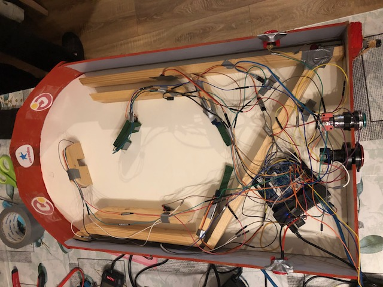

# FYS attempt 3

## Developer
Jack Zwuup

## Table of Contents
1. [ Description ](#Dst)
2. [ Background information. ](#Bgifmt)
3. [ How to use the Project ](#Htutpj)
4. [ Program set-up ](#Pgsu)
4. [ Game instructions ](#Gist)
5. [ Usage ](#Usage)
6. [Contact information](#Ctifmt)
7. [Sources and documents](#Scadcm)

## Description
This code is made to power an pinball machine for Corendon.

## Background information
The assignment originator of this project is Mats Otten and Ferry Rietveld. They will check the project.

## Functional design

## How to use the Project

#### Hardware
- Odroid
- Female to male wires
- Female to female wires
- 5 Lasers
- 5 LDR sensors
- 1 humidity and temperature sensor
- 2 actuators
- 4 buttons

#### Software
* Python
* HTML and CSS website

### Libraries
* [wiringPi]

## Program set-up
#### Python code
1. Install program, that can run python code.
2. Connect the odroid to the device.
3. Download and install the libraries above.

#### Python code

## Game instructions

Hello and welcome by Corendons pinball machine.

##### Preperation of the game
You should have a pinball machine in front of you.

##### The game
The game will start when it's ran. The game is autonomous. You can press the buttons on the side to power the flippers. If the ball rolls through the utmost right port you get 10 points. If the ball rolls through the utmost left port you get 20 points. If the ball rolls through the green port you get 30 points. If the ball rolls through the wooden port you get 40 points. If the ball falls 3 times between the flippers, the game will end. The total points will be displayed and you can enter your name or a random one. The game will stop afterwards. If you press the green button the game will start again.

If the temperature is higher than 50 deegrees celcius or if the humidity is higher than 80 percent the game will immediately stop and won't start again for safety and damage reasons. If you didn't press the left or right flipper button for 30 seconds the game will stop for energy loss prevention. If you press the red button on the front, the game will stop. 

If the red button is pressed at least three times a beautiful website will be ran. You can look at the timestamps, user input names and scores at the home page. If you type /temphumi after the link you can see the the timestamps, temperature and humidity. 

You can also test the flip and neutral stance of both the flippers, if you type /flip and /ntrl after the link.

## Usage
This project is used to imply a game of pinball. There's code used for:

#### java functions odroid
Odroid Pin Configuration
+ BUTTON_PINL: Pin connected to the left flipper button
+ BUTTON_PINR: Pin connected to the right flipper button
+ BUTTON_PIN_ON: Pin connected to the green button
+ BUTTON_PIN_OFF: Pin connected to the red button

+ SERVO_PINL: Pin connected to the left flipper
+ SERVO_PINR: Pin connected to the right flipper

+ LASER_PIN1: Pin connected to the laser opposite to lDR sensor 1
+ LASER_PIN2: Pin connected to the laser opposite to lDR sensor 2
+ LASER_PIN3: Pin connected to the laser opposite to lDR sensor 3
+ LASER_PIN4: Pin connected to the laser opposite to lDR sensor 4
+ LASER_PIN5: Pin connected to the laser opposite to lDR sensor 5

+ V1_PIN: Pin connected to middle pin of LDR sensor 1
+ V2_PIN: Pin connected to middle pin of LDR sensor 2
+ V3_PIN: Pin connected to middle pin of LDR sensor 3
+ V4_PIN: Pin connected to middle pin of LDR sensor 4

+ LDR_PIN1: Pin connected to LDR sensor 1
+ LDR_PIN2: Pin connected to LDR sensor 2
+ LDR_PIN3: Pin connected to LDR sensor 3
+ LDR_PIN4: Pin connected to LDR sensor 4
+ LDR_PIN5: Pin connected to LDR sensor 5

#### Code explanation for Odroid:
The Odroid Java functions handle the interaction between the pinball machine's hardware components and the game logic. These functions control various pins connected to buttons, flippers, lasers, LDR sensors, and more. The pin configurations define how the hardware components communicate with the game, enabling features such as flipping, scoring points, and monitoring the ball's movement.

Each pin is assigned a specific function, allowing precise control over the pinball machine's behavior during gameplay. The code defines how these pins are utilized to create an interactive and engaging pinball experience for the players.

## Contact information
Jack Zwuup - @laamronhans@gmail.com or @jackzwuup@gmail.com

## Sources and documents

